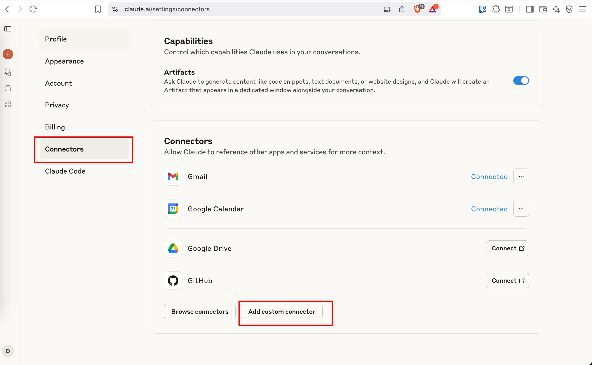
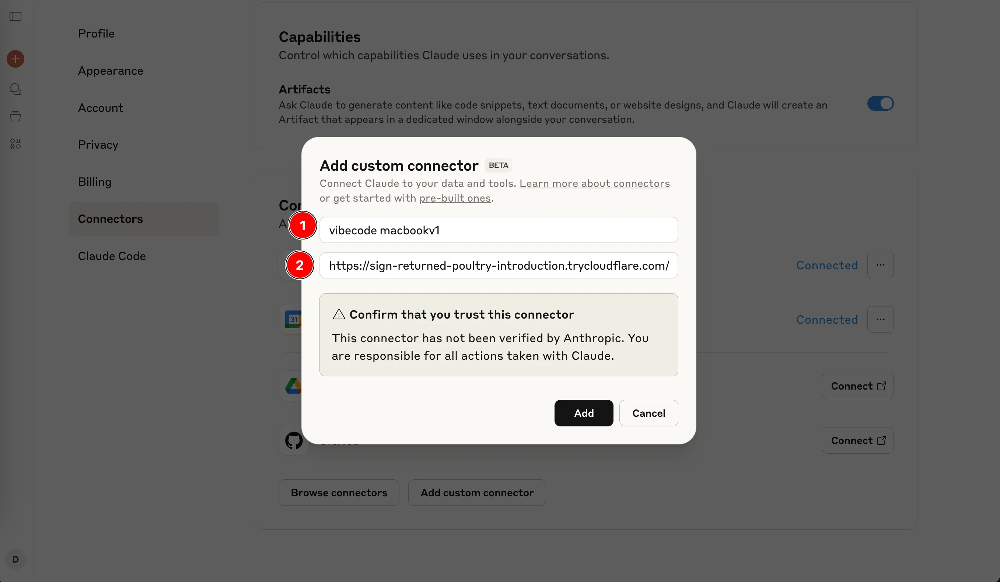
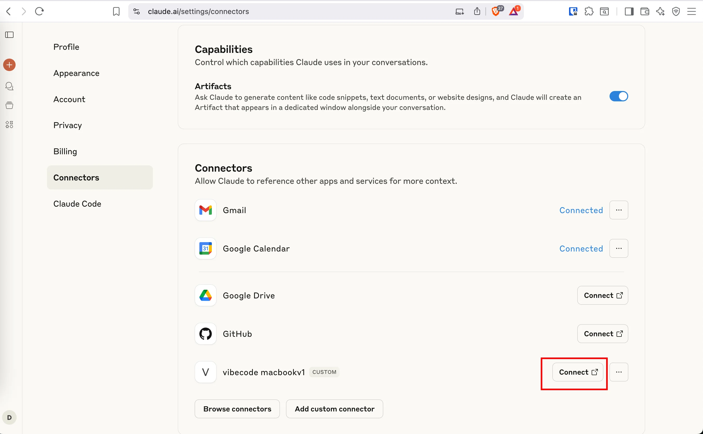

# VibeCode

True one-command MCP server for Claude-Code with automatic persistent domains and OAuth authentication.

## Why VibeCode?

- **⚡ One Command**: `vibecode start` - that's it
- **🌐 Persistent Domains**: Automatically creates stable domains that never change
- **🔐 OAuth 2.1 Authentication**: Built-in authentication for claude.ai
- **🔒 Secure by Default**: Unique UUID paths per session
- **🛠️ Zero Config**: Intelligent tunnel management
- **📱 Works Everywhere**: Use Claude-Code from any device, anywhere

## Installation

### Option 1: Install from PyPI (Coming Soon)

```bash
pip install vibecode
```

### Option 2: Install from Git (Current)

```bash
# Or install directly from git
pip install git+https://github.com/your-username/vibecode.git#subdirectory=vibecode
```

### Requirements

```bash
# Install cloudflared (macOS)
brew install cloudflared

# Or install cloudflared (Linux/Windows)
# See: https://developers.cloudflare.com/cloudflare-one/connections/connect-apps/install-and-setup/installation
```

## Quick Start

```bash
# One-time setup (optional, for persistent domain)
cloudflared tunnel login

# Start everything
vibecode start
```

**First run**: Gets a stable domain like `https://vibecode-123456.cfargotunnel.com`  
**Every run after**: Uses the same domain automatically!

Copy the URL into your Claude.ai MCP configuration once - it never changes.

## Using VibeCode with Claude.ai

### Step 1: Start Your Server

```bash
vibecode start --quick
```

Copy the public URL from the terminal output (e.g., `https://example.trycloudflare.com/uuid`)

### Query Available Tools

```bash
# Check what tools are available
curl -X POST http://localhost:8300/ \
  -H "Content-Type: application/json" \
  -d '{"jsonrpc":"2.0","id":1,"method":"tools/list","params":{}}'

# Or use the included script
python query_tools.py --info
```

Expected: **17 tools** including `claude_code` (Claude Code CLI integration)

### Step 2: Access Claude.ai Connectors

1. Go to [claude.ai/settings/connectors](https://claude.ai/settings/connectors)
2. Click on **"Connectors"** in the left sidebar (highlighted in red)
3. Click **"Add custom connector"** button at the bottom



### Step 3: Configure Your VibeCode Connector

1. In the "Add custom connector" dialog:
   - **Name**: Enter `vibecode macbookv1` (or any name you prefer)
   - **URL**: Paste your VibeCode server URL (e.g., `https://sign-returned-poultry-introduction.trycloudflare.com/<uuid>`)

2. **Important**: Make sure to use the **base URL only**


3. You'll see a security warning: "This connector has not been verified by Anthropic"
4. Click **"Add"** to continue



### Step 4: Connect to Your VibeCode Server

1. After adding the connector, you'll see it listed with your custom name
2. Click the **"Connect"** button next to your VibeCode connector
3. Claude.ai will now establish a connection to your MCP server




### What You Get

Once connected, Claude.ai can:

- **Read and write files** in your allowed directories
- **Run commands** with your permission  
- **Execute code** and see the results
- **Access your development environment** through the MCP protocol

### Example Usage

After connecting, you can ask Claude to:

```
using claude code mcp agent, write a simple helloworld python app
```

Claude will then:
1. Create the Python file
2. Write the Hello World code
3. Execute it and show you the results

## Commands

```bash
# Main command (automatically uses persistent domain if available)
vibecode start                   # Smart tunnel selection

# Options
vibecode start --quick           # Force quick tunnel (random domain)
vibecode start --no-tunnel      # Local only
vibecode start --port 9000      # Custom port

# Setup
vibecode setup                  # One-time setup guide
```

## How It Works

**Without setup** (just works):
```bash
vibecode start  # → https://abc-random.trycloudflare.com (changes each time)
```

**With one-time setup** (recommended):
```bash
cloudflared tunnel login         # One time only
vibecode start                   # → https://vibecode-123456.cfargotunnel.com (same every time)
```

VibeCode automatically:
- ✅ Detects if you're authenticated with Cloudflare
- ✅ Creates a persistent tunnel on first run
- ✅ Reuses the same tunnel (and domain) on subsequent runs
- ✅ Falls back to quick tunnels if not authenticated

## Server Configuration

### Persistent vs Quick Tunnels

- **Quick tunnels** (`--quick`): Fast setup with random domain, expires when stopped
- **Persistent tunnels** (default): Stable domain that persists across restarts

### Custom Paths

Configure which directories Claude can access:

```bash
vibecode start --allowed-paths /path/to/project --allowed-paths /another/path
```

### No Authentication Mode

For testing only (not recommended for production):

```bash
vibecode start --no-auth
```

### Local Development

Run without tunnels for local development:

```bash
vibecode start --no-tunnel --port 8300
```

## Advanced Usage

```bash
# Get setup help
vibecode setup                  # Simple setup guide
vibecode tunnel guide           # Detailed tunnel guide

# Tunnel management
vibecode tunnel list            # List your tunnels
vibecode start --tunnel my-mcp  # Use specific tunnel
```

## OAuth 2.1 Authentication

VibeCode implements OAuth 2.1 with Dynamic Client Registration (DCR) for seamless integration with Claude.ai:

- **Authorization Server Metadata**: `/.well-known/oauth-authorization-server`
- **Dynamic Client Registration**: `/register` 
- **Authorization Endpoint**: `/authorize`
- **Token Endpoint**: `/token`
- **PKCE Support**: Required for all clients
- **Public Clients**: No client secret required

### Security Features

- **UUID-based paths** for each session
- **OAuth 2.1 compliance** with Dynamic Client Registration
- **Cloudflare tunnel encryption** for secure communication
- **Directory access controls** via allowed_paths configuration

## Troubleshooting

### Connection Issues

If Claude.ai fails to connect:

1. **Check your server is running**:
   ```bash
   # Look for this output
   📡 Public URL: https://your-domain.trycloudflare.com/uuid
   ```

2. **Verify OAuth endpoints** are accessible:
   ```bash
   curl https://your-domain.trycloudflare.com/.well-known/oauth-authorization-server
   ```

3. **Check server logs** for any error messages

### Common Problems

- **404 errors**: Make sure you're using the base URL (without UUID) when adding the connector
- **Connection timeout**: Your tunnel may have expired - restart with `vibecode start`
- **Permission denied**: Check your `allowed_paths` configuration

## Technical Details

### MCP Protocol Support

VibeCode implements the full MCP (Model Context Protocol) specification:
- JSON-RPC 2.0 messaging
- Server-Sent Events (SSE) transport
- Tool calling and resource access
- Real-time bidirectional communication

### OAuth 2.1 Compliance

Full OAuth 2.1 implementation with:
- RFC 8414: Authorization Server Metadata
- RFC 9728: Protected Resource Metadata  
- RFC 7662: Token Introspection
- RFC 7009: Token Revocation
- Dynamic Client Registration (DCR)

## Requirements

- Python 3.10+
- `cloudflared` CLI ([install guide](https://developers.cloudflare.com/cloudflare-one/connections/connect-apps/install-and-setup/installation))

## Development

For contributors, see [CLAUDE.md](CLAUDE.md) for technical documentation and development setup.

## License

MIT